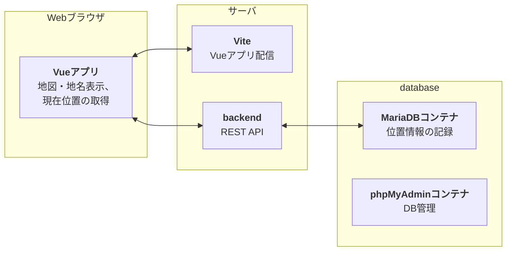
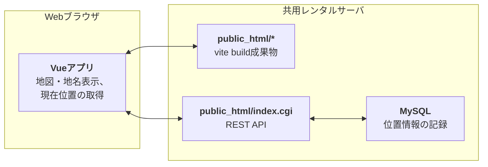

# location-logger-fastapi

Laravel+Vue3で作った位置情報を記録するSPAを、Pythonバックエンド(FastAPI+SQLModel)で作り直しました。

本プロジェクトではフロントエンド用に`node`・`npm`、バックエンド用に`uv`が必要です。

## フォルダ構成

詳細は各フォルダのREADMEを参照してください。

```text
location-logger-fastapi/   # Vueアプリ (Vite)
├── backend/          # バックエンド (Python)
└── database/         # データベース (MariaDBとphpMyAdminのコンテナを動かすDocker Compose)
```

## ローカル環境での使い方

ローカル環境では、`database`を使ってローカル環境のサーバでデータベースのコンテナを動かして、`backend`からデータベースに接続します。



### データベースとバックエンドの開始

データベースの起動方法は、[./database/README.md](./database/README.md)をご覧ください。

バックエンドの起動方法は、[./backend/README.md](./backend/README.md)をご覧ください。

### Viteの開始

Vueアプリに必要なパッケージをインストールします。

```bash
npm i
```

`.env.example`をコピーしてVite用の`.env`ファイルを作成して、バックエンドのエンドポイントURLを設定します。

```ini:.env
# バックエンドのエンドポイントURL
VITE_API_BASE_URL=http://localhost:8000
```

以下のコマンドでViteを起動してください。

```bash
npm run dev
```

Webブラウザで`http://localhost:5173/`を開きます。

## 共用レンタルサーバでの使い方

本番環境では、バックエンドをDockerコンテナで動かせれば最善ですが、私の使っている共用レンタルサーバではDockerコンテナを動かすことはできませんので、共用レンタルサーバが用意しているApache経由で、バックエンドをCGIとして動かすようにします。



### 事前準備

データベースは、レンタルサーバの管理コンソールからデータベースを作成して、`./public/.env.example`を参考に`./public/.env`を作成してください。

```ini:./public/.env
DB_HOST=<データベースのホスト名>
DB_PORT=<データベースのポート番号>
DB_NAME=<データベース名>
DB_USER=<データベースの接続ユーザー名>
DB_PASSWORD=<同パスワード>
ENGINE_ECHO=False
FRONTEND_ORIGIN=
```

### バックエンドのインストール (レンタルサーバ上での操作)

バックエンドは、私がレンタルしているサーバでは、SQLModelの依存関係(SQLAlchemy → greenlet)でコンパイルエラーが発生するため、`uv sync`でバックエンドをセットアップすることができません。そのため、`uv sync`の代わりに以下のコマンドを実行してバックエンドをセットアップします。

以下のコマンドは`ssh`で共用レンタルサーバにログインして実行してください。

```bash
cd /home/<ユーザー名>/<保存先フォルダー>/
git clone <GitHubのリポジトリURL>
cd location-logger-fastapi/backend

# 共用レンタルサーバが提供しているPython3.11を使用
/path/to/python3.11 -m venv .venv
source .venv/bin/activate
pip install --no-build greenlet  # 途中でエラーが発生しても、最後に`Successfully installed greenlet-3.2.5`のように表示されればOK
pip install .

# もし共用レンタルサーバでuvが使えるのであれば、以下のコマンドでも可
#uv venv
#uv pip install --no-build greenlet
#uv pip install .
```

インストール先のPythonのパス名を取得してください。`./public/index.cgi`の1行目に記述します。

```bash
source .venv/bin/activate
which python
```

### Vueアプリのビルドと配置 (ローカル環境での操作)

`./public/index.cgi.example`を参考に`./public/index.cgi`を作成して、1行目にレンタルサーバで取得したPythonのパス名を記述してください。

`./.env.production`を作成して、バックエンドのエンドポイントURLとして`/incex.cgi`を設定します。

```ini:.env.production
VITE_API_BASE_URL=/index.cgi
```

補足: `.htaccess`で`/api/*`を`/index.cgi/api/*`に変更する`RewriteRule`を作った場合、
`/api/*`へリクエストを送るたびにリダイレクト(301)が発生して効率が悪かったため、
Vueアプリをビルドする際に`/index.cgi`を`/api/*`の前に付けるようにしました。

私がレンタルしているサーバでは、`node`及び`npm`が動作しなかったため、ローカル環境でVueアプリをビルドしています。

```bash
npm i
npm run build
```

`scp`などを使って、`./dist`配下のファイルを共用レンタルサーバの`public_html`などのフォルダーにコピーします。

```bash
# dist配下のファイル(.envも含む)をコピーする
scp -P <ポート番号> -r ./dist/* ./dist/.[!.]* <レンタルサーバのユーザ名>@<レンタルサーバ名>:/home/<ユーザー名>/<public_htmlなどのフォルダー>
```

### レンタルサーバ上でのセットアップ

`ssh`で共用レンタルサーバにログインして、`.venv`をactivateします。

```bash
cd /home/<ユーザー名>/<保存先フォルダー>/location-logger-fastapi/backend
. .venv/bin/activate
```

`index.cgi`に実行権を追加してください。

```bash
cd <public_htmlなどのフォルダー>
chmod +x index.cgi
```

データベースを初期化してください。

```bash
# .envのあるフォルダーで操作を行う
# cd <public_htmlなどのフォルダー>
python3 -m location_logger.db init
```

データベースにテーブルができていることを確認します。

```bash
# .envのあるフォルダーで操作を行う
# cd <public_htmlなどのフォルダー>
source .env
mysql -h${DB_HOST} -P${DB_PORT} -u${DB_USER} -p${DB_PASSWORD} ${DB_NAME}
```

```mysql
SHOW TABLES;
```

また、ローカル環境からREST APIにアクセスできることを確認します。

```bash
curl https://<ホスト名>/index.cgi/api/v1/misc/version
```

Webブラウザで共用レンタルサーバ(`https://<ホスト名>/`)にアクセスして、Vueアプリが表示されることを確認します。
